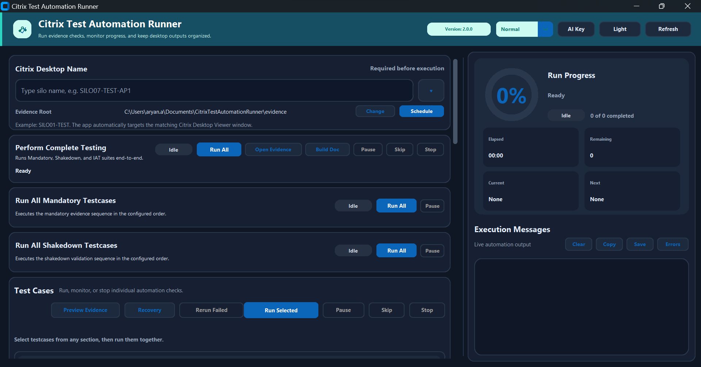

# Citrix Test Automation Runner


Internal Windows desktop application for running Citrix evidence automation, validating screenshots, organizing output by desktop, and generating Word evidence reports.



## Overview

Citrix Test Automation Runner helps testers run repeatable evidence checks inside Citrix Desktop Viewer sessions. It automates the manual evidence workflow end to end: window targeting, testcase execution, screenshot capture, screenshot overlay, OCR/AI validation, run logging, failed-test recovery, and Word report generation.

The app is designed for internal desktop validation work where evidence must remain easy to review, rerun, and share.

## Key Capabilities

| Area | Capability |
| --- | --- |
| Test execution | Complete Testing, Mandatory, Shakedown, IAT, post-complete Zscaler, Silo 43-specific checks, individual testcases, and selected testcase runs |
| Run control | Pause, Skip, Stop, Rerun Failed, Recovery, and Evidence Preview |
| Evidence capture | Desktop-scoped screenshots with Silo and Hostname overlay |
| Validation | Windows OCR first, optional OpenAI Vision fallback when OCR is inconclusive |
| Reporting | Word evidence report generation and refresh from the latest valid screenshots |
| Evidence storage | Desktop-specific folders under a configurable evidence root |
| Operator UX | Recent desktop names, AI Key dialog, theme toggle, progress monitor, execution logs, and quick evidence navigation |

## Application Layout

| UI Area | Purpose |
| --- | --- |
| Header | Version, runtime mode, AI Key, Light/Dark theme, and Refresh controls |
| Citrix Desktop Name | Exact Desktop Viewer target and recent desktop selector |
| Evidence Root | Output location for screenshots, logs, reports, and manifest files |
| Perform Complete Testing | Full suite execution across supported phases |
| Run All Mandatory / Shakedown | Focused suite execution |
| Test Cases | Individual, selected, recovery, and rerun workflows |
| Run Progress | Percent complete, elapsed time, remaining count, current testcase, and next testcase |
| Execution Messages | Live automation logs with Clear, Copy, Save, and Errors actions |

## Test Suites

### Mandatory Evidence

Core evidence required for most desktop validations. Typical checks include:

- Hostname and IP configuration
- Edge WebView version
- Microsoft Edge version
- Zscaler service status
- Google and Yahoo web access
- PowerPoint application launch and Office licensing/session evidence
- Applist validation where applicable

### Shakedown Evidence

Additional desktop health and readiness checks such as:

- Desktop availability
- Edge sync and policy/PAC validation
- FSLogix profile log evidence
- Local network drives
- OneDrive sync
- Temp folder behavior
- Windows version

### Silo 43 Evidence

Silo 43-only checks:

- Oracle 12 bin path
- NICE environment variables
- `C:\apps\VLSClient\VLSMain.exe` privilege warning
- `ping prod.dvfs.com`
- `C:\BAD\` folder modified-date validation

The app blocks Silo 43-specific testcases with a user-facing error popup when the selected desktop is not a Silo 43 desktop.

### IAT And Post-Complete Checks

Complete Testing can include IAT validation and post-complete Zscaler evidence. Post-complete Zscaler is independently recoverable so it can be rerun without repeating the full suite.

## Evidence Output

Default evidence root:

```text
%USERPROFILE%\Documents\CitrixTestAutomationRunner\evidence
```

Each desktop gets its own output folder:

```text
evidence\<Citrix Desktop Name>\
|-- logs\
|-- screenshots\
|   |-- Mandatory Evidence\
|   |-- Shakedown Evidence\
|   |-- IAT Evidence\
|   `-- Silo 43 Evidence\
|-- run_manifest.json
`-- <generated Word report>.docx
```

The evidence root can be changed from the app when a tester needs output under another approved folder, such as Downloads.

## Validation Flow

Screenshot validation is layered:

1. Capture screenshot.
2. Apply Silo and Hostname overlay.
3. Run OCR validation where supported.
4. If OCR is inconclusive and AI fallback is configured, run OpenAI Vision validation.
5. Retry only where the testcase supports retry.
6. Save final pass/fail evidence and update `run_manifest.json`.

OCR is always attempted first. AI is only used as a fallback when configured, so routine validations stay local and fast.

## OpenAI API Key Handling

The OpenAI key is not stored in GitHub or bundled into the release ZIP.

Lookup order:

1. `OPENAI_API_KEY` environment variable.
2. User-local saved key from the app.
3. Optional config value if explicitly added by an operator.

Packaged app flow:

1. Launch the app.
2. Click **AI Key**.
3. Paste the key into the masked field.
4. Use **Test Key** to verify connectivity.
5. Click **Save Key**.

The saved key is stored locally for the current Windows user:

```text
%APPDATA%\CitrixTestAutomationRunner\openai_settings.json
```

## Development Setup

Use Python 3.13 on Windows.

```powershell
python -m venv .venv
.\.venv\Scripts\Activate.ps1
pip install -r requirements.txt
python run_app.py
```

If PowerShell blocks activation scripts, run Python directly from the virtual environment or use the method approved by endpoint policy.

## Packaging

Build a release package:

```powershell
powershell -ExecutionPolicy Bypass -File scripts\build_release.ps1 -Version 2.0.0
```

Generated artifacts:

```text
release\Citrix_Test_Automation_Runner_v2.0.0\
release\Citrix_Test_Automation_Runner_v2.0.0.zip
```

The release package includes the executable, config, test cases, quick-start documentation, rollout documentation, and version file.

## Repository Map

```text
run_app.py                         App entry point
config/config.json                 Waits, paths, runtime mode, validation settings
src/gui/main_window.py             CustomTkinter UI and user workflow controls
src/core/runner.py                 Individual testcase execution and validation flow
src/core/master_runner.py          Mandatory, shakedown, complete, and scheduled execution
src/core/screenshot.py             Screenshot capture, overlay, and clipboard handling
src/core/word_report.py            Word report generation
src/core/ocr_validation.py         OCR validation helpers
src/core/windows_ocr.py            Windows OCR integration
src/core/ai_validation.py          OpenAI Vision fallback validation
src/core/openai_settings.py        Local OpenAI API key management
test_cases/                        UI automation testcase scripts
documentation/                     User guide and overview deck
docs/images/                       README screenshots
```

## Git Safety

Do not commit:

- `release/`
- `dist/`
- `build/`
- evidence screenshots or logs
- local desktop history
- API keys or secrets
- OpenAI probe files

The app stores user-level runtime secrets outside the repository.

## Support Checklist

When reporting an issue, include:

- App version shown in the header.
- Citrix Desktop Name used for the run.
- Testcase or suite name.
- Latest JSON log path.
- Latest screenshot path.
- Whether OCR, AI fallback, retry, or manual intervention was involved.
