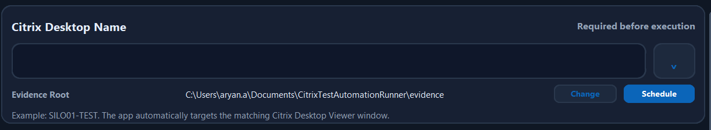

# Citrix Test Automation Runner - Quick Start


Use this guide when you only need to install the packaged app, run testing, and collect evidence.



## 1. Install

1. Download the approved release ZIP from the internal SharePoint, OneDrive, or network location.
2. Extract the ZIP locally, recommended:

   ```text
   C:\Users\<your-user>\Documents\CitrixTestAutomationRunner
   ```

3. Open the extracted folder.
4. Double-click:

   ```text
   CitrixTestAutomationRunner.exe
   ```

Do not run the app directly from inside the ZIP file.

## 2. Prepare Citrix

Before starting a run:

- Open the required Citrix Desktop Viewer session.
- Make sure the desktop is signed in and visible.
- Do not leave the session on a login, QR, lock, or reconnect screen.
- Copy the exact Citrix Desktop Viewer title if possible.

Example desktop name:

```text
SILO01-TEST - Desktop Viewer
```

## 3. Select The Desktop

1. Paste or type the exact title into **Citrix Desktop Name**.
2. Use the dropdown if the desktop name was used recently.
3. Confirm the app shows the desktop name as ready.
4. Confirm the Evidence Root is correct.

Default evidence root:

```text
C:\Users\<your-user>\Documents\CitrixTestAutomationRunner\evidence
```

## 4. Run Testing

Choose the smallest run scope that matches your need.

| Action | When To Use |
| --- | --- |
| **Run All** under Perform Complete Testing | Full evidence run |
| **Run All Mandatory Testcases** | Mandatory evidence only |
| **Run All Shakedown Testcases** | Shakedown evidence only |
| Individual **Run** | Rerun one testcase |
| **Run Selected** | Run a custom set of selected testcases |
| **Rerun Failed** | Retry failed evidence after a report has already been generated |

While the run is active:

- Do not interact with the Citrix desktop.
- Watch **Run Progress** for current and next testcase.
- Watch **Execution Messages** for live status.
- Use **Pause**, **Skip**, or **Stop** only when needed.

## 5. Review Evidence

After completion:

1. Use **Open Evidence** to open the desktop-specific evidence folder.
2. Use **Preview Evidence** to review captured screenshots inside the app.
3. Use **Recovery** if failed or manual-review items need focused reruns.
4. Use **Build Doc** to regenerate the Word report from the latest evidence.
5. Use **Download Report** from completion dialogs when a report should be copied to a chosen location.

## 6. Evidence Folder Layout

Each desktop gets its own folder:

```text
evidence\<Citrix Desktop Name>\
|-- logs\
|-- screenshots\
|   |-- Mandatory Evidence\
|   |-- Shakedown Evidence\
|   |-- IAT Evidence\
|   `-- Silo 43 Evidence\
|-- run_manifest.json
`-- <generated Word report>.docx
```

## 7. AI Key Setup

AI validation is optional fallback support for screenshots where OCR is inconclusive.

To configure it:

1. Click **AI Key** in the header.
2. Paste the key into the masked field.
3. Click **Test Key**.
4. Click **Save Key** if the test succeeds.

The key is saved only for your Windows user:

```text
%APPDATA%\CitrixTestAutomationRunner\openai_settings.json
```

## 8. Common Issues

| Issue | What To Check |
| --- | --- |
| Automation runs on the local machine | Desktop name does not exactly match the Citrix Desktop Viewer title |
| Screenshot is early, blank, or wrong | Rerun the individual testcase; check Execution Messages |
| Report still shows a previous failure | Click **Build Doc** after rerun |
| Silo 43 testcase is blocked | Silo 43 testcases only run against Silo 43 desktops |
| AI validation fails | Use **AI Key > Test Key**, then rerun or manually validate |
| App does not launch | Confirm the ZIP was extracted and endpoint security did not quarantine the EXE |

## 9. Support Package

If you need support, share:

- Desktop name used.
- App version shown in the header.
- Screenshot path.
- JSON log path.
- UI execution log if saved.
- Short description of what failed or required manual action.
